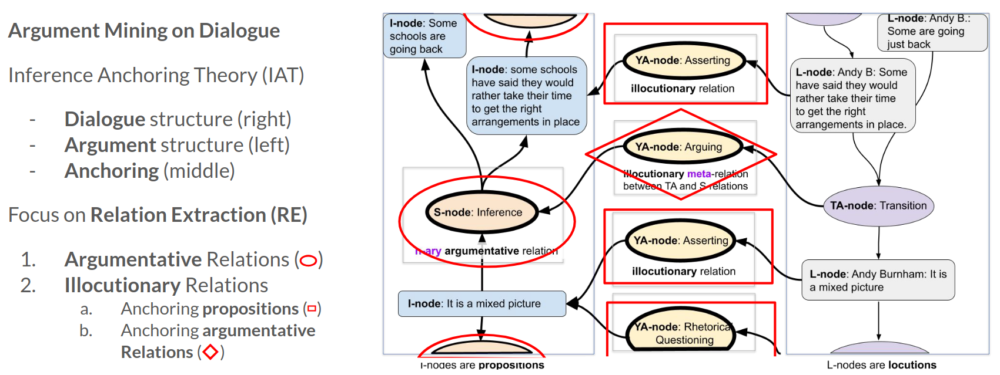

<div align="center">

# DFKI-MLST@DialAM-2024 Shared Task

<a href="https://pytorch.org/get-started/locally/"></a>
<a href="https://pytorchlightning.ai/"></a>
<a href="https://hydra.cc/"></a>
<a href="https://github.com/ArneBinder/pytorch-ie-hydra-template-1"></a><br>
[](https://aclanthology.org/2024.argmining-1.9)
[](https://aclanthology.org/volumes/2024.argmining-1)

</div>



## 📌 Description

This repository contains the code for our submission to the DialAM-2024 Shared Task as described in the
paper [DFKI-MLST at DialAM-2024 Shared Task: System Description (Binder et al., ArgMining 2024)](https://aclanthology.org/2024.argmining-1.9/) and
[poster](presentation/poster-2024-argument-mining-workshop-poster.pdf) presented at the ArgMining 2024 workshop co-located with
ACL 2024 in Bangkok, Thailand. The task was part of the workshop and focused on the identification
of argumentative relations in dialogues. See the [official website](https://dialam.arg.tech/) for more information.

### 📃 Abstract

We present the dfki-mlst submission for the DialAM shared task on identification of argumentative and illocutionary
relations in dialogue. Our model achieves the best results in the global setting: 48.25 F1 at the focused level when
looking only at the related arguments/locutions and 67.05 F1 at the general level when evaluating the complete
argument maps. We describe our implementation of the data pre-processing pipeline, relation encoding and
classification, evaluating 11 different base models and performing experiments with, e.g., node text combination
and data augmentation. Our source code is publicly available.

### ✨ How to Reproduce the Results from Our Paper

1. Set up the environment as described in the [Environment Setup](#environment-setup) section.
2. Train models with the configuration from the paper (this will execute 3 runs with different seeds):
   ```bash
   python src/train.py \
   experiment=dialam2024_merged_relations \
   base_model_name=microsoft/deberta-v3-large \
   model.task_learning_rate=1e-4 \
   +model.classifier_dropout=0.1 \
   datamodule.batch_size=8 \
   trainer=gpu \
   seed=1,2,3 \
   +hydra.callbacks.save_job_return.integrate_multirun_result=true \
   --multirun
   ```
3. Run the inference on the test set (the `model_save_dir`s from the training step will be used as the
   `model_name_or_path`, see the content of the `job_return_value.json` in your `logs/training` folder
   for the exact paths):
   ```bash
   python src/predict.py \
   dataset=dialam2024_prepared \
   +dataset.input.name=merged_relations \
   model_name_or_path=MODEL/SAVE/DIR1,MODEL/SAVE/DIR2,MODEL/SAVE/DIR3 \
   +pipeline.device=0 \
   +pipeline.batch_size=8 \
   --multirun
   ```
   or run the inference with the model checkpoint from the paper ([from Huggingface hub](https://huggingface.co/DFKI-SLT/dfki-mlst-deberta-v3)):
   ```bash
   python src/predict.py \
   dataset=dialam2024_prepared \
   +dataset.input.name=merged_relations \
   model_name_or_path=DFKI-SLT/dfki-mlst-deberta-v3 \
   +pipeline.device=0 \
   +pipeline.batch_size=8
   ```
4. Evaluate the results:
   First, convert the serialized JSON documents into the JSON format required for the DialAM Shared
   Task with each nodeset in a separate JSON file (note that `INPUT/DATA/DIR` is the path to one of the
   directories where the predicted outputs from the previous step are stored):
   ```bash
   python src/utils/convert_documents2nodesets.py \
   --input_dir=INPUT/DATA/DIR \
   --output_dir=PREDICTION/DATA/DIR
   ```
   Second, evaluate using the official script for argumentative relations:
   ```bash
   python src/evaluation/eval_official.py \
   --gold_dir=GOLD/DATA/DIR \
   --predictions_dir=PREDICTION/DATA/DIR \
   --mode=arguments
   ```
   ... and for illocutionary relations:
   ```bash
   python src/evaluation/eval_official.py \
   --gold_dir=GOLD/DATA/DIR \
   --predictions_dir=PREDICTION/DATA/DIR \
   --mode=illocutions
   ```

### 🔮 Inference with the Trained Model on New Data

```python
import json

# this import is necessary to load the pipeline
from pie_modules.taskmodules import RETextClassificationWithIndicesTaskModule
from pytorch_ie import AutoPipeline

from dataset_builders.pie.dialam2024.dialam2024 import PREFIX_SEPARATOR, merge_relations, unmerge_relations, \
    REVERSE_SUFFIX, NONE_LABEL, convert_to_document
from src.document.types import SimplifiedDialAM2024Document, TextDocumentWithLabeledEntitiesAndNaryRelations
from src.utils.nodeset_utils import Nodeset
from src.utils.prepare_data import prepare_nodeset

# load the model from the Huggingface hub
# to execute on a GPU, pass device="0" (and batch_size=...) to .from_pretrained
pipe = AutoPipeline.from_pretrained("DFKI-SLT/dfki-mlst-deberta-v3")
# disable because it can cause errors when no model inputs are created
pipe.taskmodule.collect_statistics = False

# load nodeset in the format of the shared task test data
path = "/home/arbi01/Downloads/test-data(8)/test/test_map1.json"
with open(path, "r") as f:
    nodeset: Nodeset = json.load(f)
nodeset_id="test_map1"
cleaned_nodeset: Nodeset = prepare_nodeset(
    nodeset=nodeset,
    nodeset_id=nodeset_id,
    s_node_text=NONE_LABEL,
    ya_node_text=NONE_LABEL,
    s_node_type="RA",
    reversed_text_suffix=REVERSE_SUFFIX,
    l2i_similarity_measure="lcsstr",
    add_gold_data=False,
)

doc: SimplifiedDialAM2024Document = convert_to_document(nodeset=cleaned_nodeset, nodeset_id=nodeset_id)
doc: TextDocumentWithLabeledEntitiesAndNaryRelations = merge_relations(
    document=doc,
    labeled_span_layer="l_nodes",
    nary_relation_layers=["ya_i2l_nodes", "ya_s2ta_nodes", "s_nodes"],
    sep=PREFIX_SEPARATOR,
)

# inference (works also with multiple documents)
doc: TextDocumentWithLabeledEntitiesAndNaryRelations = pipe(doc)

doc: SimplifiedDialAM2024Document = unmerge_relations(document=doc, sep=PREFIX_SEPARATOR)
# print predictions
print("Predictions:")
print("S-Nodes:")
for rel in doc.s_nodes.predictions:
    if rel.label != "NONE":
        print(rel.resolve())
print("YA-S2TA-Nodes:")
for rel in doc.ya_i2l_nodes.predictions:
    if rel.label != "NONE":
        print(rel.resolve())
print("YA-I2L-Nodes:")
for rel in doc.ya_s2ta_nodes.predictions:
    if rel.label != "NONE":
        print(rel.resolve())

print("done")

# Predictions:
# S-Nodes:
# ('Default Rephrase', (('source', ('L', 'AudienceMember 20210912QT02: did what we were told')), ('target', ('L', 'AudienceMember 20210912QT02: We followed the guidance'))))
# ('Default Inference-rev', (('source', ('L', 'AudienceMember 20210912QT02: It makes me sick')), ('target', ('L', "AudienceMember 20210912QT02: Then you hear they're having Christmas parties while we are suffering"))))
# ...
# YA-S2TA-Nodes:
# ('Asserting', (('source', ('L', 'AudienceMember 20210912QT02: My parents both had COVID')),))
# ('Asserting', (('source', ('L', 'AudienceMember 20210912QT02: We followed the guidance')),))
# ...
# YA-I2L-Nodes:
# ('Restating', (('source', ('L', 'AudienceMember 20210912QT02: We followed the guidance')), ('target', ('L', 'AudienceMember 20210912QT02: did what we were told'))))
# ('Arguing', (('source', ('L', "AudienceMember 20210912QT02: Then you hear they're having Christmas parties while we are suffering")), ('target', ('L', 'AudienceMember 20210912QT02: It makes me sick'))))
# ...
# done
```

## 🚀 Quickstart

### Environment Setup

```bash
# clone project
git clone https://github.com/ArneBinder/dialam-2024-shared-task.git
cd dialam-2024-shared-task

# [OPTIONAL] create conda environment
conda create -n dialam-2024-shared-task python=3.9
conda activate dialam-2024-shared-task

# install PyTorch according to instructions
# https://pytorch.org/get-started/

# install remaining requirements
pip install -r requirements.txt

# [OPTIONAL] symlink log directories and the default model directory to
# "$HOME/experiments/dialam-2024-shared-task" since they can grow a lot
bash setup_symlinks.sh $HOME/experiments/dialam-2024-shared-task

# [OPTIONAL] set any environment variables by creating an .env file
# 1. copy the provided example file:
cp .env.example .env
# 2. edit the .env file for your needs!
```

### Model Training

**Have a look into the [train.yaml](configs/train.yaml) config to see all available options.**

Train model with default configuration

```bash
# train on CPU
python src/train.py

# train on GPU
python src/train.py trainer=gpu
```

Execute a fast development run (train for two steps)

```bash
python src/train.py +trainer.fast_dev_run=true
```

Train model with chosen experiment configuration from [configs/experiment/](configs/experiment/)

```bash
python src/train.py experiment=conll2003
```

You can override any parameter from command line like this

```bash
python train.py trainer.max_epochs=20 datamodule.batch_size=64
```

Start multiple runs at once (multirun):

```bash
python src/train.py seed=42,43 --multirun
```

Notes:

- this will execute two experiments (one after the other), one for each seed
- the results will be aggregated and stored in `logs/multirun/`, see the last logging output for the exact path

### Model evaluation

This will evaluate the model on the test set of the chosen dataset using the *metrics implemented within the model*.
See [config/dataset/](configs/dataset/) for available datasets.

**Have a look into the [evaluate.yaml](configs/evaluate.yaml) config to see all available options.**

```bash
python src/evaluate.py dataset=conll2003 model_name_or_path=pie/example-ner-spanclf-conll03
```

Notes:

- add the command line parameter `trainer=gpu` to run on GPU

### Inference

This will run inference on the given dataset and split. See [config/dataset/](configs/dataset/) for available datasets.
The result documents including the predicted annotations will be stored in the `predictions/` directory (exact
location will be printed to the console).

**Have a look into the [predict.yaml](configs/predict.yaml) config to see all available options.**

```bash
python src/predict.py dataset=conll2003 model_name_or_path=pie/example-ner-spanclf-conll03
```

Notes:

- add the command line parameter `+pipeline.device=0` to run the inference on GPU 0

### Evaluate Serialized Documents

This will evaluate serialized documents including predicted annotations (see [Inference](#inference)) using a
*document metric*. See [config/metric/](configs/metric/) for available metrics.

**Have a look into the [evaluate_documents.yaml](configs/evaluate_documents.yaml) config to see all available options**

```bash
python src/evaluate_documents.py metric=f1 metric.layer=entities +dataset.data_dir=PATH/TO/DIR/WITH/SPLITS
```

Note: By default, this utilizes the dataset provided by the
[from_serialized_documents](configs/dataset/from_serialized_documents.yaml) configuration. This configuration is
designed to facilitate the loading of serialized documents, as generated during the [Inference](#inference) step. It
requires to set the parameter `data_dir`. If you want to use a different dataset,
you can override the `dataset` parameter as usual with any existing dataset config, e.g `dataset=conll2003`. But
calculating the F1 score on the bare `conll2003` dataset does not make much sense, because it does not contain any
predictions. However, it could be used with statistical metrics such as
[count_text_tokens](configs/metric/count_text_tokens.yaml) or
[count_entity_labels](configs/metric/count_entity_labels.yaml).

## Development

```bash
# run pre-commit: code formatting, code analysis, static type checking, and more (see .pre-commit-config.yaml)
pre-commit run -a

# run tests
pytest -k "not slow" --cov --cov-report term-missing
```

## 📃 Citation

```bibtex
@inproceedings{binder-etal-2024-dfki,
    title = "{DFKI}-{MLST} at {D}ial{AM}-2024 Shared Task: System Description",
    author = "Binder, Arne  and
      Anikina, Tatiana  and
      Hennig, Leonhard  and
      Ostermann, Simon",
    editor = "Ajjour, Yamen  and
      Bar-Haim, Roy  and
      El Baff, Roxanne  and
      Liu, Zhexiong  and
      Skitalinskaya, Gabriella",
    booktitle = "Proceedings of the 11th Workshop on Argument Mining (ArgMining 2024)",
    month = aug,
    year = "2024",
    address = "Bangkok, Thailand",
    publisher = "Association for Computational Linguistics",
    url = "https://aclanthology.org/2024.argmining-1.9",
    doi = "10.18653/v1/2024.argmining-1.9",
    pages = "93--102",
    abstract = "This paper presents the dfki-mlst submission for the DialAM shared task (Ruiz-Dolz et al., 2024) on identification of argumentative and illocutionary relations in dialogue. Our model achieves best results in the global setting: 48.25 F1 at the focused level when looking only at the related arguments/locutions and 67.05 F1 at the general level when evaluating the complete argument maps. We describe our implementation of the data pre-processing, relation encoding and classification, evaluating 11 different base models and performing experiments with, e.g., node text combination and data augmentation. Our source code is publicly available.",
}
```
